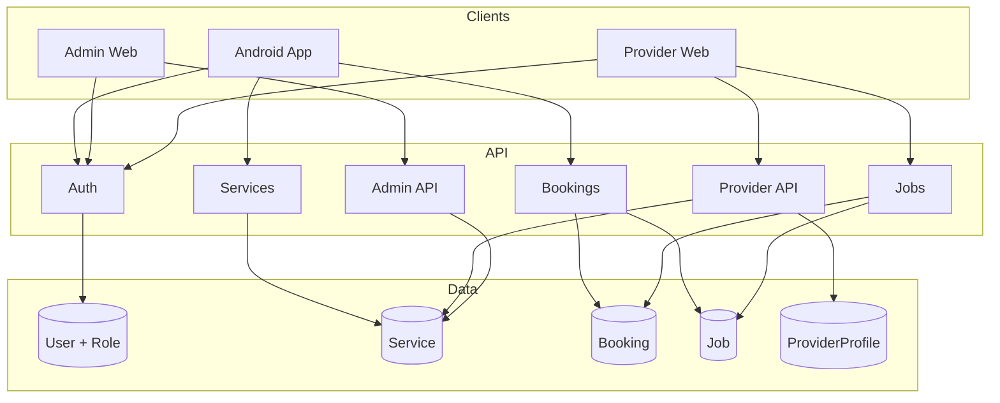

# Cleanly: Cleaning Service Booking Platform

> Plan for transforming Cleanly into a full cleaning-service booking platform. Use this doc for future reference when implementing features.

## 0. Vision and principles (app plan)

**Architecture**

- **Backend is shared by all frontends.** One backend (Node.js/Express API) serves the Android app, any other mobile apps (e.g. future iOS), and the web app (admin + provider cabinet). Same API, auth, and data for every client; no separate backend per frontend.

**Business model**

- **Companies and individual providers are recruited the same way.** The platform does not compete with cleaning companies; it gives them customers. Both providers and companies are supply-side partners who receive bookings from Cleanly. Same onboarding, verification, and job-pickup flow for both; companies additionally have employees and can assign jobs to them.
- **Provider/company parity:** Individual cleaners and cleaning companies are both recruited as supply-side partners. They use the same provider cabinet (web), same verification and “my services” flow, and the same job-pickup API (`GET /jobs`, `POST /jobs`). Companies additionally can create company employees and assign jobs to them. No separate “B2B” funnel—one recruitment and onboarding path for all service providers.

**Payment strategy**

- **Dummy backend first:** The backend supports a "dummy" payment mode (default) that always returns success (booking created, payment confirmed) so the full flow works without payment-provider keys.
- **Easy swap to real payment provider:** We will use **Payoneer or similar** (not Stripe). Payment code is behind a single abstraction (backend: payment provider interface; clients: same API contract). Swapping dummy for the chosen provider is config/env only (e.g. `PAYMENT_PROVIDER=dummy|payoneer`), no change to booking or checkout logic.
- **Payment quality bar:** Payment and money flows must meet 2025–2026 standards: idempotency where applicable, clear success/failure, no double charges, audit-friendly. Financial bugs are unacceptable; UI or logic bugs are lower risk.

---

## Current state

- **Android**: Kotlin, Jetpack Compose, Hilt, Room, Ktor client. Generic User + Task model; no roles, no cleaning domain.
- **Backend**: Node.js, Express, Prisma, PostgreSQL (Neon), JWT. Single `User` and `Task`; auth sets `req.userId` only.
- **Web**: None. No admin or provider UI.

You need: **customer app** (full booking flow + pay), **web admin** (full access to everything), **provider cabinet** (individual cleaners: verification, services, jobs), **company cabinet** (customize services, manage employees, see job results, transparent to admin), **strict role-based UX**, **verification** (providers and companies), and **payments** (Payoneer or similar).

---

## 1. Product scope: menus and surfaces

**Customer app (mobile)**

| Menu / area | Purpose |
|-------------|---------|
| Home / Dashboard | Quick access: book cleaning, my bookings, account. |
| Book cleaning | Full flow: choose services → cart → address & date/time → special requests → payment → confirmation. |
| My bookings | List (upcoming, past); detail per booking (status, provider/job, address, cancel/rebook). |
| Profile / Account | Contact info, saved addresses, payment methods, notifications, help, logout. |

**Provider cabinet (web – individual cleaners)**

| Menu / area | Purpose |
|-------------|---------|
| Dashboard | Verification status, available jobs, my jobs summary. |
| Verification | Upload documents, view status (PENDING / VERIFIED / REJECTED), resubmit if rejected. |
| My services | Select which platform services I offer; set my pricing/availability if allowed. |
| Available jobs | List of bookings needing a provider; pick up a job. |
| My jobs | Jobs I’ve picked; update status (en route, in progress, completed); add completion notes/photos if required. |
| Profile | Contact, payout info (when integrated), notifications. |

**Company cabinet (web – cleaning companies)**

| Menu / area | Purpose |
|-------------|---------|
| Dashboard | Verification status, available jobs, my team’s jobs, company metrics. |
| Verification | Company documents (registration, insurance, etc.), status, resubmit if rejected. |
| My services | Customize which platform services the company offers; override pricing/description per service if allowed. |
| Company employees | List, invite, deactivate; roles; assign employees to jobs. |
| Available jobs | Bookings needing a provider; company picks up (then assigns to employee). |
| My jobs / Assignments | All jobs picked by company; assign to employee; update status; see completion (notes, photos, customer feedback). |
| Job results & quality | View work results per employee (completed jobs, time, feedback, issues); same data visible to admins for transparency. |
| Profile | Company details, payout info, notifications. |

**Admin (web – platform)**

| Menu / area | Purpose |
|-------------|---------|
| Dashboard | Overview: bookings today, pending verifications, open jobs, alerts. |
| Services | Full CRUD for platform service catalog; activate/deactivate. |
| Users | List all users by role (customer, provider, company, company_employee, admin); view/edit basic info; suspend. |
| Providers & companies | List; view verification status and documents; approve/reject with reason; suspend. |
| Bookings | List all bookings; filter by status, date, customer; view detail; cancel if needed. |
| Jobs | List all jobs; filter by provider/company; view assignment and status; see completion data. |
| Quality & results | Same view as company “job results”: see which provider/employee did which job, completion notes/photos, customer ratings; ensure cleaning is provided properly; flag disputes. |
| Reports / Analytics | Bookings volume, revenue, provider/company performance, verification funnel (optional). |
| Settings | Platform config, cancellation/refund policy, notification templates (optional). |

---

## 2. Customer flow: booking cleaning (elaborate)

End-to-end flow with all nuances a customer needs to complete a booking.

1. **Discover services**
   - Browse platform services (name, description, duration, base price).
   - Optional: filters (e.g. by type), search.
   - Add one or more services to cart (with quantity); see running total.

2. **Cart**
   - Review selected services and total.
   - Edit quantities or remove items.
   - Proceed to checkout.

3. **Checkout – Address**
   - Enter or select saved address (full address, optional apartment/floor, access instructions).
   - Validate address if needed (e.g. geocode or “confirm address”).
   - Optional: save address for future.

4. **Checkout – Date & time**
   - Choose date (calendar; block past dates and optionally blackout dates).
   - Choose time slot (e.g. morning / afternoon / evening or specific slots).
   - Show clear “expected duration” based on cart (e.g. 2–3 hours).

5. **Checkout – Special requests**
   - Optional free-text: “Pets at home”, “Parking code”, “Preferred entrance”.
   - Optional: “Recurring” (future: weekly/monthly) – can be out of scope for MVP but placeholder in flow.

6. **Checkout – Summary & payment**
   - Summary: address, date, time, services, total, special requests.
   - One-click “Edit” for any step.
   - Payment: collect via payment provider (Payoneer or similar); idempotent; clear success/failure.
   - After success: show confirmation (booking ID, date, time, “We’ll assign a cleaner soon”).

7. **Post-booking**
   - Customer sees booking in “My bookings” (status: PENDING → CONFIRMED when payment confirmed).
   - When a provider/company picks the job: customer can see “Provider assigned” (and optionally name/company) if we expose it.
   - Notifications (optional): “Booking confirmed”, “Provider assigned”, “Cleaning completed”.
   - After completion: optional customer review/rating (see § below).

**Edge cases to handle in flow**

- No available slots for selected date (show message, suggest other dates).
- Payment failure: retry with same or different method; do not create CONFIRMED booking until payment success.
- Cancel booking: only when allowed by policy (e.g. before 24 h); show cancellation in My bookings.

---

## 3. Verification: providers and companies

**Individual provider verification**

- **Required**: Identity (e.g. ID document), optional proof of address; platform may require specific doc types.
- **Flow**: Provider uploads documents in Provider cabinet → status PENDING → admin (or automated) reviews → VERIFIED or REJECTED (with reason).
- **Rejection**: Provider sees reason; can fix and resubmit; status back to PENDING.
- **Until VERIFIED**: Provider cannot pick jobs (or only in test mode); clear messaging “Complete verification to get jobs”.

**Company verification**

- **Required**: Business registration, insurance (if required), authorized representative ID; list configurable by admin.
- **Flow**: Same as provider: upload in Company cabinet → PENDING → admin review → VERIFIED / REJECTED with reason; resubmit allowed.
- **Until VERIFIED**: Company cannot pick jobs.

**Admin review**

- Admin sees list of PENDING providers and companies; opens each to view uploaded documents.
- Actions: Approve (set VERIFIED), Reject (mandatory reason, visible to provider/company).
- Audit: who approved/rejected and when (store in history if needed).

---

## 4. Company cabinet: services, employees, job results, transparency

**Customize services**

- Company sees platform service catalog; can toggle “we offer this” per service.
- If platform allows overrides: company can set its own price or description per service (stored as company-specific offer).
- Admin can see which companies offer which services (for support and quality).

**Manage employees**

- List company employees (linked users with role company_employee).
- Invite: create/link user (email invite or add existing user); assign role.
- Deactivate: employee no longer receives new assignments; existing jobs can be reassigned.
- No separate “worker app” required for MVP: company assigns jobs in cabinet; employee can have limited view (e.g. “my assigned jobs”) in same cabinet or later in a simple app.

**Job results and work of employees**

- For each job: status (picked → assigned → in progress → completed), assigned employee, completion time.
- On completion: provider/company can add notes and optionally photos (e.g. “before/after” or proof of completion).
- Customer can leave rating/feedback (see § below); company sees feedback per job and per employee.
- **Company view**: “Job results” / “Team performance” – list of completed jobs by employee, with notes, photos, and customer feedback.
- **Transparency with admin**: Admins have the same visibility – same “Job results” view (by company, by provider, by employee). Ensures platform can verify that cleaning was provided and handle disputes.

**Admin oversight**

- Admin can open any booking/job and see: who did it (provider or company + employee), completion notes/photos, customer rating.
- Admin can flag issues, contact provider/company or customer, and (future) apply refunds or penalties based on policy.

---

## 5. Data model and roles

Introduce **roles** and cleaning-domain entities while keeping one auth surface.

**Roles (suggested)**

- `customer` – book and pay (current "user" in app).
- `provider` – individual cleaner; offers services, gets verified, picks jobs.
- `company` – company account; offers services, has company employees, assigns jobs.
- `company_employee` (enum value: **EMPLOYEE**) – cleaner belonging to a company; has reference to the company; no direct login to provider cabinet (or limited "worker" view).
- `platform_admin` – manages service catalog and (optionally) verification.

**Core entities (Prisma)**

- **User** – add `role` enum (`CUSTOMER` | `PROVIDER` | `COMPANY` | `EMPLOYEE` | `PLATFORM_ADMIN`), optional `companyId` for company employees, optional payment-provider customer/account IDs (e.g. for Payoneer) when we integrate the chosen provider.
- **Service** – id, name, description, basePrice, durationMinutes, active, createdBy (null = platform), admin-only or platform-managed.
- **Booking** – id, customerId, status (PENDING | CONFIRMED | IN_PROGRESS | COMPLETED | CANCELLED), scheduledAt, address, totalPrice, paymentIntentId (provider-agnostic); relation to **BookingService** (bookingId, serviceId, quantity, priceSnapshot).
- **Job** – "provider side" of a booking: bookingId, providerId (or companyId), assignedCompanyEmployeeId (nullable), status, so providers/companies "pick up" by creating/updating Job.
- **ProviderProfile** (or extend User) – provider/company verification status (PENDING | VERIFIED | REJECTED), documents, offered service IDs.
- **CompanyEmployee** – companyId, userId (company_employee), role, so companies can create "mini-cabinets" and assign jobs to company employees.

Keep **RefreshToken** as-is. Add indexes on `User.role`, `Booking.customerId`, `Booking.status`, `Job.providerId`, `Job.bookingId`.

This gives: one place to add/remove services (admin), providers/companies offer services and pass verification, companies can assign jobs to company employees, and clear permission boundaries.

**Extended entities (for full production)**

- **VerificationDocument** – providerId or companyId, documentType (ID, INSURANCE, REGISTRATION, etc.), fileUrl, status, uploadedAt; admin can view and approve/reject per document or per profile.
- **ProviderService** (optional) – companyId or providerId, serviceId, customPrice, customDescription; for company “customize services”.
- **JobCompletion** – jobId, completedAt, notes (text), photoUrls (optional); submitted by provider/company when marking job completed.
- **Review** – bookingId, customerId, rating (1–5), comment (optional), createdAt; one per booking after completion.
- **VerificationHistory** – providerProfileId, action (APPROVED | REJECTED), adminUserId, reason (optional), createdAt; for audit.
- **Address** (optional) – userId (customer), label, fullAddress, accessInstructions; for saved addresses.

---

## 6. API design: lean and no request loops

**Principles**

- **Single-responsibility responses**: One request returns everything the client needs for the next screen (e.g. booking details with services, provider, and payment status in one call).
- **No redundant refetch**: After create/update, return full resource in response; client updates local state/cache from that.
- **Optimistic-friendly**: Mutations return updated entity; use same DTO for list and detail.
- **Idempotency**: For payment and booking creation, accept `Idempotency-Key` and return cached result on replay.

**Suggested endpoints (REST, under `/api/v1`)**

- **Auth** (existing + role in token):
  - `POST /auth/login`, `POST /auth/register` – include `role` in body for register; JWT payload includes `userId` and `role`.
  - `POST /auth/refresh` – same.

- **Services (catalog)**
  - `GET /services` – public or customer; list active services (used for booking).
  - Admin: `GET/POST/PUT/DELETE /admin/services` – full CRUD; protect by `role === PLATFORM_ADMIN`.

- **Bookings (customer)**
  - `POST /bookings` – body: `{ scheduledAt, address, items: [{ serviceId, quantity }] }`; create booking + PaymentIntent (or similar), return booking + clientSecret for client-side confirm. One call.
  - `GET /bookings` – current user's bookings (with services and status).
  - `GET /bookings/:id` – one booking with services, job (if any), payment status.
  - `PATCH /bookings/:id/cancel` – cancel if allowed.

- **Jobs (provider/company)**
  - `GET /jobs` – list jobs for this provider/company (with booking + customer summary).
  - `POST /jobs` – "pick up" a booking (body: `bookingId`); create Job.
  - `PATCH /jobs/:id` – update status, assign `assignedCompanyEmployeeId` (company only).

- **Provider cabinet**
  - `GET/PUT /provider/profile` – verification status, offered service IDs (from platform list).
  - `GET/POST/PUT/DELETE /provider/company-employees` – companies only; mini-cabinets (invite/link user as company_employee).

- **Payments**
  - `POST /bookings/:id/confirm-payment` – client confirms payment (e.g. after provider SDK); server validates and updates booking status.
  - Webhooks: e.g. `POST /webhooks/payoneer` (or provider-specific) – handle payment success/failure; no client polling.

- **Verification**
  - `GET/PUT /provider/profile` – already includes verification status; extend with document upload (or separate `POST /provider/documents`).
  - `GET /provider/documents` – list uploaded documents; admin: `GET /admin/providers/:id/documents`, `POST /admin/providers/:id/verify` (approve/reject with reason).
  - Same for companies: `GET/PUT /provider/profile` (company profile), documents, and `POST /admin/companies/:id/verify`.

- **Job completion and results**
  - `PATCH /jobs/:id` – extend with status COMPLETED and body `{ completedAt, notes, photoUrls }` (or `POST /jobs/:id/complete`).
  - `GET /jobs` – include completion data and customer review when present.
  - Company: `GET /provider/job-results` – completed jobs with employee, notes, photos, rating. Admin: `GET /admin/job-results` – same data, filter by provider/company/date.

- **Reviews**
  - `POST /bookings/:id/review` – customer submits rating + optional comment (after job completed).
  - `GET /bookings/:id` – include review if present. Provider/company and admin see reviews on job/booking.

- **Admin: full access**
  - `GET /admin/users` – list users (filter by role, search).
  - `GET /admin/bookings`, `GET /admin/jobs` – list all; same detail endpoints with role check.
  - `GET /admin/providers`, `GET /admin/companies` – list with verification status; approve/reject verification.
  - `GET /admin/job-results`, `GET /admin/quality` – job results and quality overview (same data as company sees).

- **Customer**
  - `GET /customers/addresses`, `POST/PUT/DELETE /customers/addresses` – saved addresses (optional for MVP).
  - Booking body: extend with `specialRequests` (text), optional `addressId` if saved addresses exist.

Middleware: after `requireAuth`, add `requireRole(['customer'])` (or provider, company, admin) so each route is clearly scoped. No extra "get me" loops: role comes from JWT.

---

## 7. Android app: slick, fast, dark, optimistic

**Design direction (Monobank-like, spotless)**

- **Dark-first**: Single dark theme; avoid purple/pink; use dark surfaces (e.g. #0D0D0D), subtle cards, one accent (e.g. green or cyan) for CTAs and success.
- **Typography**: Clear hierarchy (e.g. one strong sans); generous spacing; minimal decoration.
- **Motion**: Short, purposeful animations (e.g. 200–300 ms); skeleton or placeholder while loading; no spinners where a single request can be avoided.

**Performance and "no extra requests"**

- **One load per screen**: Home loads "my bookings" + "available services" in one batch endpoint if needed (e.g. `GET /customers/dashboard`) or two parallel calls with no dependency; list screens get one paginated list.
- **Optimistic UI**: On "add to cart" / "create booking", update UI immediately; on "pay", show success and then reconcile with webhook or one status check. Rollback on failure with a clear message.
- **Cache**: Keep Room for offline and cache; sync on focus or after mutations using the response body instead of refetching.
- **Avoid loops**: No "load booking → load services → load provider". Server returns booking with nested services and job/provider in one `GET /bookings/:id`.

**Flows**

- **Booking flow**: Services list → cart → checkout (address, date/time, special requests) → `POST /bookings` → payment (provider SDK or dummy) → `POST /bookings/:id/confirm-payment` → success screen (optimistic).
- **My bookings**: Single `GET /bookings`; list and detail use same DTOs; cancel when allowed by policy.

**Tech**: Keep Ktor; payment via provider SDK (e.g. Payoneer or similar) or dummy; use Compose state for cart and optimistic updates.

---

## 8. Web: admin panel, provider cabinet, company cabinet

**Stack suggestion**: One web app (e.g. Next.js or React + Vite) with route-based access:

- `/admin/*` – platform admin only (service CRUD).
- `/provider/*` – provider or company only (dashboard, services they offer, verification, jobs, company employees).
- Login redirects by role (admin → /admin, provider/company → /provider).

**Admin panel (full access)**

- **Dashboard**: Counts and links to pending verifications, today’s bookings, open jobs.
- **Services**: List, add, edit, deactivate (no hard delete if referenced).
- **Users**: List by role, search, view detail, suspend.
- **Providers & companies**: List with verification status; open profile → view documents → approve/reject with reason.
- **Bookings**: List all, filter by status/date; view detail; cancel if needed.
- **Jobs**: List all, filter; view detail, assignment, status, completion.
- **Quality & results**: Same view as company “job results” – completed jobs by provider/company/employee, with notes, photos, customer rating; flag issues.

**Provider cabinet (individual)**

- **Verification**: Upload docs, view status (PENDING/VERIFIED/REJECTED); submit once, no polling (or one status on load).
- **My services**: Select from platform services (one `GET /services`), save "my offered services" in one `PUT /provider/profile`.
- **Jobs**: List `GET /jobs`; "pick up" = `POST /jobs`; for companies, assign to company employee in `PATCH /jobs/:id`.
**Company cabinet (full)**

- **Companies only**: **Company employees** – list, invite (create/link user), deactivate, assign to jobs.
- **Company services**: Toggle which platform services company offers; optional custom price/description per service.
- **Job results / Team performance**: List completed jobs by employee; notes, photos, customer rating; same data visible to admin for transparency.

**Permissions**

- Middleware or route guard: JWT role in cookie or header; reject with 403 and redirect to login or "access denied".
- API already enforces role per route; web only shows menus/routes allowed for that role.

---

## 9. Other production aspects

- **Notifications**: Optional in-app or email for “Booking confirmed”, “Provider assigned”, “Job completed”; configurable later. MVP can skip or use simple email.
- **Cancellation policy**: Define rules (e.g. free cancel until 24 h before); show in checkout and in My bookings; backend enforces when `PATCH /bookings/:id/cancel` is allowed.
- **Reviews and ratings**: Customer can submit rating + comment after job completed; provider/company and admin see them; use for “Job results” and quality oversight.
- **Support / help**: Link or in-app “Help” / “Contact support”; optional ticket system later. MVP: static help page or mailto.
- **Production readiness**: Env-based config, structured logging, error handling, security (rate limit, CORS, secure cookies for web), health check endpoint.

---

## 10. Payments: Payoneer or similar

**Target provider: Payoneer (or similar)**

- We are **not** using Stripe. The production payment provider will be **Payoneer** or a similar provider.
- Payment code is behind a single abstraction (see § 0). The backend supports `PAYMENT_PROVIDER=dummy` (default) and can add e.g. `payoneer` when integrating the chosen provider.
- **Flow**: Create payment intent when booking is created; client confirms via provider SDK or redirect; webhook (or provider callback) updates booking status so no polling.
- **Payouts** (to providers/companies): to be defined with the chosen provider (e.g. Payoneer mass pay or similar).

**Current codebase**

- The repo currently has a **Stripe** implementation behind the abstraction (optional; used when `PAYMENT_PROVIDER=stripe`). This can remain for testing or be replaced by a Payoneer (or similar) implementation when ready.

---

## 11. Implementation chunks (manageable parts)

The full app is split into phases and chunks so work can be parallelized and delivered incrementally. Dependencies are noted; complete Phase N before or in parallel with chunks that depend on it.

**Phase A – Foundation (backend + shared)**

| Chunk | Title | Description | Deps |
|-------|--------|-------------|------|
| A1 | Schema and roles | Prisma: User.role, Service, Booking, BookingService, Job, ProviderProfile, CompanyEmployee; migrations; auth with role in JWT and requireRole middleware. Sub-plan: [docs/CHUNK_A1_SUBPLAN.md](docs/CHUNK_A1_SUBPLAN.md). | — |
| A2 | Services API | GET /services (public), admin CRUD /admin/services. | A1 |
| A3 | Bookings API (core) | POST/GET /bookings, GET /bookings/:id, PATCH cancel; payment abstraction + dummy provider. | A1 |
| A4 | Jobs API | GET /jobs, POST /jobs (pick up), PATCH /jobs/:id (status, assign employee). | A1, A3 |
| A5 | Provider profile API | GET/PUT /provider/profile (verification status, offered service IDs); company-employees CRUD for companies. | A1 |

**Phase B – Verification and completion**

| Chunk | Title | Description | Deps |
|-------|--------|-------------|------|
| B1 | Verification model and API | VerificationDocument (or inline in ProviderProfile), upload; admin GET documents, POST approve/reject with reason; verification history. | A1, A5 |
| B2 | Job completion and results | JobCompletion (notes, photoUrls); PATCH /jobs/:id complete; GET job-results for provider/company and admin. | A4 |
| B3 | Reviews | Review model; POST /bookings/:id/review; include review in booking/job responses. | A3, B2 |

**Phase C – Customer app (Android)**

| Chunk | Title | Description | Deps |
|-------|--------|-------------|------|
| C1 | Customer UI foundation | Theme (dark), nav (Home, Book, My bookings, Profile); auth; GET /services and GET /bookings. | A2, A3 |
| C2 | Full booking flow | Cart → checkout (address, date/time, special requests) → POST /bookings → payment (dummy then real provider) → confirm-payment → success. | A3, C1 |
| C3 | My bookings and profile | List/detail bookings; cancel; saved addresses (optional); profile screen. | A3, C1 |

**Phase D – Web: provider and company cabinet**

| Chunk | Title | Description | Deps |
|-------|--------|-------------|------|
| D1 | Web app shell | React/Next.js app; auth (login, JWT, role); route guards; redirect by role (admin vs provider/company). | A1 |
| D2 | Provider cabinet | Dashboard, verification (upload, status), my services, available jobs, my jobs (pick up, status). | A4, A5, B1, D1 |
| D3 | Company cabinet | Company employees (list, invite, assign); company services (toggle, optional overrides); job results / team performance view. | A4, A5, B2, D2 |
| D4 | Admin panel (full) | Dashboard, services CRUD, users list, providers/companies list + verification review, bookings/jobs list, quality/job-results view. | A2, A3, A4, B1, B2, B3, D1 |

**Phase E – Payments and polish**

| Chunk | Title | Description | Deps |
|-------|--------|-------------|------|
| E1 | Real payment provider | Integrate Payoneer (or chosen provider) behind existing abstraction; webhook; document in README. | A3 |
| E2 | Notifications and policy | Cancellation policy (backend rules + UI copy); optional email/in-app notifications; help/support link. | A3, C2 |
| E3 | Production readiness | Env config, logging, error handling, rate limit, CORS, health check; security review. | All |

**Suggested order**

1. Run Phase A (A1 → A2, A3, A4, A5 in parallel where possible).
2. Phase B (B1, B2, B3) after A.
3. Phase C (Android) in parallel with Phase D (web) once A and B are usable: C1 → C2 → C3; D1 → D2 → D3, D4.
4. Phase E last: E1, E2, E3.

A separate **AI chunk prompts** document (e.g. `docs/AI_CHUNK_PROMPTS.md`, git-ignored) can list for each chunk: context, exact prompt, acceptance criteria, and key files, so agents or developers can “make chunk X” independently.

---

## 12. Diagram (roles and flows)

---

## 13. Key files to add or change

| Area | Action |
|------|--------|
| `backend/prisma/schema.prisma` | Add role, Service, Booking, Job, ProviderProfile, CompanyEmployee; extend User. |
| `backend/src/middleware/auth.js` | Add `requireRole(allowedRoles)`; JWT payload includes `role`. |
| `backend/src/routes` | New: services.js, bookings.js, jobs.js, provider.js, admin/services.js; webhooks for payment provider (e.g. stripe.js for current impl, payoneer later). |
| `app/.../ui/theme/Color.kt`, `Theme.kt` | Dark-only palette; typography. |
| `app/.../api/ApiService.kt` | Add services, bookings, payment confirm; remove or alias tasks. |
| New web app | New folder (e.g. `web/` or `admin-web/`) with Next.js/React, auth, admin + provider routes. |

---

## 14. Summary

- **Architecture**: One backend shared by all frontends (Android, any other mobile apps, web admin and provider/company cabinet); same API, auth, and data.
- **Product scope**: Customer app (full booking flow, my bookings, profile); provider cabinet (verification, services, jobs); company cabinet (services, employees, job results, transparent to admin); admin (full access: services, users, providers/companies, bookings, jobs, quality/results).
- **Customer flow**: Elaborate booking path: services → cart → address → date/time → special requests → payment → confirmation; edge cases (no slots, payment failure, cancel) handled.
- **Verification**: Individual providers and companies submit documents; admin approves/rejects with reason; resubmit allowed; no job pickup until VERIFIED.
- **Company + admin**: Companies customize services, manage employees, see job results (notes, photos, ratings) per employee; admins see the same data to ensure cleaning is provided properly.
- **Data**: Roles; Service, Booking, Job, ProviderProfile, CompanyEmployee; VerificationDocument, JobCompletion, Review; extended API for verification, completion, reviews, admin.
- **Implementation**: Split into Phase A (foundation), B (verification + completion + reviews), C (Android), D (web cabinets + admin), E (payments + polish); each phase has manageable chunks with clear deps and acceptance criteria.
- **Payments**: Payoneer or similar (not Stripe); dummy + provider abstraction for easy swap.

This plan covers the whole production-ready app and is split into manageable chunks so work can be parallelized and delivered incrementally.
