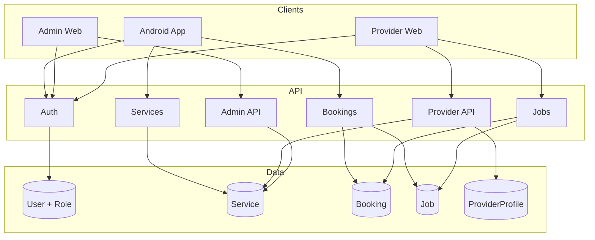

# Cleanly: Cleaning Service Booking Platform

> Plan for transforming Cleanly into a full cleaning-service booking platform. Use this doc for future reference when implementing features.

## 0. Vision and principles (app plan)

**Business model**

- **Companies and individual providers are recruited the same way.** The platform does not compete with cleaning companies; it gives them customers. Both providers and companies are supply-side partners who receive bookings from Cleanly. Same onboarding, verification, and job-pickup flow for both; companies additionally have employees and can assign jobs to them.
- **Provider/company parity:** Individual cleaners and cleaning companies are both recruited as supply-side partners. They use the same provider cabinet (web), same verification and “my services” flow, and the same job-pickup API (`GET /jobs`, `POST /jobs`). Companies additionally can create company employees and assign jobs to them. No separate “B2B” funnel—one recruitment and onboarding path for all service providers.

**Payment strategy**

- **Dummy backend first:** The backend supports a "dummy" payment mode (default) that always returns success (booking created, payment confirmed) so the full flow works without Stripe keys.
- **Easy swap to real Stripe:** Payment code is behind a single abstraction (backend: payment provider interface; clients: same API contract). Swapping dummy for Stripe is config/env only (`PAYMENT_PROVIDER=dummy|stripe`), no change to booking or checkout logic.
- **Payment quality bar:** Payment and money flows must meet 2025–2026 standards: idempotency where applicable, clear success/failure, no double charges, audit-friendly. Financial bugs are unacceptable; UI or logic bugs are lower risk.

---

## Current state

- **Android**: Kotlin, Jetpack Compose, Hilt, Room, Ktor client. Generic User + Task model; no roles, no cleaning domain.
- **Backend**: Node.js, Express, Prisma, PostgreSQL (Neon), JWT. Single `User` and `Task`; auth sets `req.userId` only.
- **Web**: None. No admin or provider UI.

You need: **user app** (book + pay), **web admin** (manage services), **provider cabinet** (services, verification, company employees/job assignment), **strict role-based UX**, and **payments** (Stripe + alternatives).

---

## 1. Data model and roles

Introduce **roles** and cleaning-domain entities while keeping one auth surface.

**Roles (suggested)**

- `customer` – book and pay (current "user" in app).
- `provider` – individual cleaner; offers services, gets verified, picks jobs.
- `company` – company account; offers services, has company employees, assigns jobs.
- `company_employee` – cleaner belonging to a company; has reference to the company; no direct login to provider cabinet (or limited "worker" view).
- `platform_admin` – manages service catalog and (optionally) verification.

**Core entities (Prisma)**

- **User** – add `role` enum (`CUSTOMER` | `PROVIDER` | `COMPANY` | `COMPANY_EMPLOYEE` | `PLATFORM_ADMIN`), optional `companyId` for company employees, optional `stripeCustomerId` / `stripeAccountId` for payments.
- **Service** – id, name, description, basePrice, durationMinutes, active, createdBy (null = platform), admin-only or platform-managed.
- **Booking** – id, customerId, status (PENDING | CONFIRMED | IN_PROGRESS | COMPLETED | CANCELLED), scheduledAt, address, totalPrice, stripePaymentIntentId; relation to **BookingService** (bookingId, serviceId, quantity, priceSnapshot).
- **Job** – "provider side" of a booking: bookingId, providerId (or companyId), assignedCompanyEmployeeId (nullable), status, so providers/companies "pick up" by creating/updating Job.
- **ProviderProfile** (or extend User) – provider/company verification status (PENDING | VERIFIED | REJECTED), documents, offered service IDs.
- **CompanyEmployee** – companyId, userId (company_employee), role, so companies can create "mini-cabinets" and assign jobs to company employees.

Keep **RefreshToken** as-is. Add indexes on `User.role`, `Booking.customerId`, `Booking.status`, `Job.providerId`, `Job.bookingId`.

This gives: one place to add/remove services (admin), providers/companies offer services and pass verification, companies can assign jobs to company employees, and clear permission boundaries.

---

## 2. API design: lean and no request loops

**Principles**

- **Single-responsibility responses**: One request returns everything the client needs for the next screen (e.g. booking details with services, provider, and payment status in one call).
- **No redundant refetch**: After create/update, return full resource in response; client updates local state/cache from that.
- **Optimistic-friendly**: Mutations return updated entity; use same DTO for list and detail.
- **Idempotency**: For payment and booking creation, accept `Idempotency-Key` and return cached result on replay.

**Suggested endpoints (REST, under `/api/v1`)**

- **Auth** (existing + role in token):
  - `POST /auth/login`, `POST /auth/register` – include `role` in body for register; JWT payload includes `userId` and `role`.
  - `POST /auth/refresh` – same.

- **Services (catalog)**
  - `GET /services` – public or customer; list active services (used for booking).
  - Admin: `GET/POST/PUT/DELETE /admin/services` – full CRUD; protect by `role === PLATFORM_ADMIN`.

- **Bookings (customer)**
  - `POST /bookings` – body: `{ scheduledAt, address, items: [{ serviceId, quantity }] }`; create booking + PaymentIntent (or similar), return booking + clientSecret for client-side confirm. One call.
  - `GET /bookings` – current user's bookings (with services and status).
  - `GET /bookings/:id` – one booking with services, job (if any), payment status.
  - `PATCH /bookings/:id/cancel` – cancel if allowed.

- **Jobs (provider/company)**
  - `GET /jobs` – list jobs for this provider/company (with booking + customer summary).
  - `POST /jobs` – "pick up" a booking (body: `bookingId`); create Job.
  - `PATCH /jobs/:id` – update status, assign `assignedCompanyEmployeeId` (company only).

- **Provider cabinet**
  - `GET/PUT /provider/profile` – verification status, offered service IDs (from platform list).
  - `GET/POST/PUT/DELETE /provider/company-employees` – companies only; mini-cabinets (invite/link user as company_employee).

- **Payments**
  - `POST /bookings/:id/confirm-payment` – client confirms payment (e.g. Stripe confirm); server validates and updates booking status.
  - Webhooks: `POST /webhooks/stripe` – handle payment success/failure; no client polling.

Middleware: after `requireAuth`, add `requireRole(['customer'])` (or provider, company, admin) so each route is clearly scoped. No extra "get me" loops: role comes from JWT.

---

## 3. Android app: slick, fast, dark, optimistic

**Design direction (Monobank-like, spotless)**

- **Dark-first**: Single dark theme; avoid purple/pink; use dark surfaces (e.g. #0D0D0D), subtle cards, one accent (e.g. green or cyan) for CTAs and success.
- **Typography**: Clear hierarchy (e.g. one strong sans); generous spacing; minimal decoration.
- **Motion**: Short, purposeful animations (e.g. 200–300 ms); skeleton or placeholder while loading; no spinners where a single request can be avoided.

**Performance and "no extra requests"**

- **One load per screen**: Home loads "my bookings" + "available services" in one batch endpoint if needed (e.g. `GET /customers/dashboard`) or two parallel calls with no dependency; list screens get one paginated list.
- **Optimistic UI**: On "add to cart" / "create booking", update UI immediately; on "pay", show success and then reconcile with webhook or one status check. Rollback on failure with a clear message.
- **Cache**: Keep Room for offline and cache; sync on focus or after mutations using the response body instead of refetching.
- **Avoid loops**: No "load booking → load services → load provider". Server returns booking with nested services and job/provider in one `GET /bookings/:id`.

**Flows**

- **Booking flow**: Services list (from `GET /services`) → cart (local state) → checkout (address, date/time) → `POST /bookings` → payment sheet (Stripe SDK) → `POST /bookings/:id/confirm-payment` → success screen (optimistic).
- **My bookings**: Single `GET /bookings`; list and detail use same DTOs.

**Tech**: Keep Ktor, add Stripe Android SDK for payment sheet; use Compose state for cart and optimistic updates.

---

## 4. Web: admin panel and provider cabinet

**Stack suggestion**: One web app (e.g. Next.js or React + Vite) with route-based access:

- `/admin/*` – platform admin only (service CRUD).
- `/provider/*` – provider or company only (dashboard, services they offer, verification, jobs, company employees).
- Login redirects by role (admin → /admin, provider/company → /provider).

**Admin panel**

- **Services**: List, add, edit, deactivate (no hard delete if referenced). Simple table + form; no extra requests: save returns updated list or item.

**Provider cabinet**

- **Verification**: Upload docs, view status (PENDING/VERIFIED/REJECTED); submit once, no polling (or one status on load).
- **My services**: Select from platform services (one `GET /services`), save "my offered services" in one `PUT /provider/profile`.
- **Jobs**: List `GET /jobs`; "pick up" = `POST /jobs`; for companies, assign to company employee in `PATCH /jobs/:id`.
- **Companies only**: **Company employees** – list, invite (create/link user), assign to jobs; minimal "mini-cabinet" so company_employee sees only assigned jobs (or limited view).

**Permissions**

- Middleware or route guard: JWT role in cookie or header; reject with 403 and redirect to login or "access denied".
- API already enforces role per route; web only shows menus/routes allowed for that role.

---

## 5. Payments: Stripe and alternatives

**Stripe (recommended)**

- **Customers**: Stripe Customer per app user (or per booking); Checkout Session or Payment Element for one-time "booking total".
- **Providers**: Stripe Connect (Express or Custom) for payouts to providers/companies; optional for MVP.
- **Flow**: Create PaymentIntent (or Session) when booking is created; Android uses Stripe SDK to confirm; webhook updates booking status so no polling.

**Alternatives to suggest**

- **Paddle**: Good for global tax handling and merchant-of-record; less flexible for marketplaces.
- **Adyen**: Strong for multi-currency and marketplaces; more integration effort.
- **Square**: Simple APIs and in-person option; good if you add in-person later.
- **PayPal (Braintree)**: Familiar for users; consider as second option alongside Stripe.

Recommendation: **Stripe first** (best docs, SDKs, webhooks); add one alternative (e.g. PayPal) later if needed.

---

## 6. Implementation order (high level)

1. **Schema and auth**
   - Prisma: add `role`, extend User; add Service, Booking, BookingService, Job, ProviderProfile, CompanyEmployee; migrations.
   - Auth: register/login accept role; JWT payload includes `role`; middleware `requireRole`.

2. **Backend APIs**
   - Services: public list + admin CRUD.
   - Bookings: create (with payment intent), list, get by id, cancel.
   - Jobs: list, create (pick up), update (assign, status).
   - Provider: profile (get/put), company-employees (companies).
   - Webhook: Stripe payment events.

3. **Android**
   - Theme: dark-only, new palette, typography.
   - Services list and "cart"; checkout screen; `POST /bookings`; integrate Stripe; optimistic booking flow.
   - My bookings (list + detail from single responses).
   - Remove or repurpose old "tasks" to avoid confusion.

4. **Web app**
   - Next.js (or React) app; auth (login, store JWT, role).
   - Admin: service list and CRUD.
   - Provider: verification, "my services", jobs (pick up, assign), company employees (company).
   - Route guards by role.

5. **Provider verification**
   - Document upload and status flow; admin or automated checks; update ProviderProfile.

6. **Payments**
   - Stripe Connect (if payouts to providers needed); otherwise Stripe one-time payments only for MVP.

---

## 7. Diagram (roles and flows)

---

## 8. Key files to add or change

| Area | Action |
|------|--------|
| `backend/prisma/schema.prisma` | Add role, Service, Booking, Job, ProviderProfile, CompanyEmployee; extend User. |
| `backend/src/middleware/auth.js` | Add `requireRole(allowedRoles)`; JWT payload includes `role`. |
| `backend/src/routes` | New: services.js, bookings.js, jobs.js, provider.js, admin/services.js; webhooks/stripe.js. |
| `app/.../ui/theme/Color.kt`, `Theme.kt` | Dark-only palette; typography. |
| `app/.../api/ApiService.kt` | Add services, bookings, payment confirm; remove or alias tasks. |
| New web app | New folder (e.g. `web/` or `admin-web/`) with Next.js/React, auth, admin + provider routes. |

---

## 9. Summary

- **Data**: Roles on User; Service, Booking, Job, ProviderProfile, CompanyEmployee; clear ownership and assignment.
- **API**: One-call-where-possible, no refetch loops; idempotency for payment/booking; role-based middleware.
- **Android**: Dark, minimal, Monobank-inspired; optimistic UI; single batch or single response per screen; Stripe for payment.
- **Web**: One app, admin (service CRUD) + provider (verification, services, jobs, company employees); route guards by role.
- **Payments**: Stripe first; optional second option (e.g. PayPal) later.

This keeps the codebase lean, avoids request loops, and gives you a clear path from current Cleanly to a full cleaning-booking platform with multiple permission layers and a single, slick user app plus focused web experiences for admin and providers.
